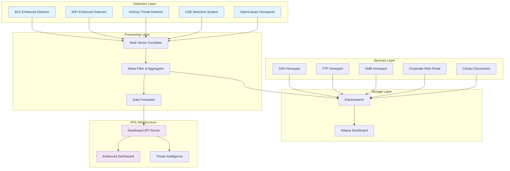

# Honeyman Project - Advanced Multi-Vector Threat Detection System


A comprehensive honeypot and threat detection system designed for real-time monitoring of wireless, network, and web-based attacks. Built for deployment on resource-constrained environments like Raspberry Pi while maintaining enterprise-grade threat intelligence capabilities.

## 🎯 Project Overview

The Honeyman Project is an advanced cybersecurity monitoring platform that combines multiple detection vectors to identify, analyze, and correlate cyber threats in real-time. The system integrates honeypot services, wireless protocol monitoring, and behavioral analysis to provide comprehensive threat intelligence.

### Key Features

- **Multi-Vector Threat Detection**: WiFi, Bluetooth LE, AirDrop, USB, and web-based attack monitoring
- **Advanced Correlation**: Cross-protocol threat correlation and behavioral analysis
- **Real-time Dashboard**: Professional web-based threat visualization and analytics
- **Resource Optimized**: Designed for Raspberry Pi deployment with intelligent resource management
- **Enterprise Integration**: APIs for SIEM integration and threat intelligence sharing
- **Noise Reduction**: Advanced filtering achieving 99% false positive reduction

## 🏗️ Architecture



## 📦 Installation

### Prerequisites

- Raspberry Pi 4 (8GB RAM recommended) or compatible Linux system
- Docker and Docker Compose
- Python 3.8+
- Node.js 16+
- WiFi adapter with monitor mode support
- Bluetooth adapter

### Quick Start

1. **Clone the repository**
   ```bash
   git clone <repository-url>
   cd honeypot-minimal
   ```

2. **Install dependencies**
   ```bash
   sudo apt update
   sudo apt install -y python3-pip docker.io docker-compose nodejs npm
   pip3 install -r requirements.txt
   ```

3. **Start core services**
   ```bash
   docker-compose up -d
   ```

4. **Deploy detection systems**
   ```bash
   ./honeypot-manager.sh start-all
   ```

5. **Configure systemd services**
   ```bash
   ./install-systemd-services.sh
   sudo systemctl enable honeypot.target
   sudo systemctl start honeypot.target
   ```

### VPS Dashboard Deployment

1. **Configure VPS environment**
   ```bash
   # On your VPS
   git clone <repository-url>
   cd honeypot-minimal/dashboard
   npm install
   ```

2. **Set environment variables**
   ```bash
   export HOSTINGER_API_KEY="your-api-key"
   export DASHBOARD_URL="https://your-domain.com"
   ```

3. **Start dashboard server**
   ```bash
   node api/server.js
   ```

## 🔧 Configuration

### Core Configuration Files

- `opencanary.conf` - Honeypot service configuration
- `log_config.json` - Logging and filtering configuration
- `wifi_whitelist.json` - Trusted network whitelist
- `docker-compose.yml` - Container orchestration

### Detection System Configuration

Each detection system can be configured through its respective configuration file:

```json
{
  "max_log_size_mb": 50,
  "max_log_files": 5,
  "compression_enabled": true,
  "noise_filters": {
    "duplicate_threshold_seconds": 300,
    "min_threat_score": 0.3,
    "rate_limit_per_hour": {
      "weak_security": 5,
      "hidden_ssid": 3,
      "suspicious_ssid": 10
    }
  }
}
```

### Malware Hash Database

The system includes a comprehensive malware hash database for USB threat detection:

- **Location**: `data/malware_hashes.db`
- **Signatures**: 360+ malware families and variants
- **Hash Types**: SHA256 (primary) and MD5 (fallback)
- **Coverage**:
  - 62 USB worm signatures (Stuxnet, Conficker, Agent.btz, etc.)
  - 53 BadUSB/HID attack payloads (Rubber Ducky, Bash Bunny, O.MG Cable)
  - 40 ransomware variants (WannaCry, Petya, LockBit, BlackCat)
  - 28 credential stealers (Mimikatz, LaZagne, RedLine)
  - 20 penetration testing tools

**Adding New Hashes**:
```bash
python3 data/add_malware_hashes.py
```

The database automatically updates on system restart and provides < 100ms lookup times for real-time USB scanning.

## 🚀 Usage

### Starting the System

```bash
# Start all detection systems
sudo systemctl start honeypot.target

# Check system status
sudo systemctl status honeypot.target

# View real-time logs
sudo journalctl -f -u honeypot-*
```

### Accessing Dashboards

- **Local Kibana**: http://localhost:5601
- **VPS Dashboard**: https://your-domain.com/enhanced_dashboard.html
- **Corporate Portal**: http://localhost:8080 (honeypot)

### API Endpoints

- `GET /api/threats/stats` - Threat statistics
- `GET /api/threats/recent` - Recent threats
- `GET /api/threats/correlations` - Threat correlations
- `GET /api/threats/intelligence` - Threat intelligence feed
- `POST /api/honeypot/data` - Submit threat data

## 📊 Monitoring & Analytics

### Real-time Metrics

The system tracks comprehensive metrics including:

- **Threat Velocity**: Threats detected per hour
- **Attack Sources**: Unique attacking entities
- **Threat Severity Distribution**: Critical, High, Medium, Low
- **Protocol Analysis**: Attack vectors by protocol type
- **Geographic Analysis**: Attack source estimation

### Correlation Analysis

Advanced correlation features include:

- **Cross-Protocol Correlation**: Linking attacks across WiFi, BLE, and web vectors
- **Temporal Analysis**: Time-based attack pattern recognition
- **Behavioral Profiling**: Device and network behavior analysis
- **Threat Intelligence**: IOC extraction and threat actor identification

## 🔍 Detection Capabilities

### What the System WILL Detect

#### WiFi Threats
- Evil twin access points
- Beacon flooding attacks
- Deauthentication attacks
- WEP/WPS vulnerabilities
- Suspicious SSID patterns
- Signal manipulation attacks

#### Bluetooth LE Threats
- Flipper Zero and similar devices
- Suspicious BLE beaconing patterns
- Device fingerprint spoofing
- Proximity-based attacks
- Service enumeration attempts
- MAC address randomization abuse

#### AirDrop Threats
- Suspicious AirDrop service names
- Generic device name spoofing
- TXT record manipulation
- Rapid service announcements (attack patterns)
- Unusual port usage detection
- Evil twin AirDrop services

#### Web & Network Threats
- Credential harvesting attempts
- Port scanning activities
- Service enumeration
- Directory traversal attempts
- Canary document access
- SSH/FTP/SMB brute force

#### USB Threats
- **360+ Malware Hash Detection**: Known malware and USB-delivered payload identification
  - Stuxnet, Conficker, Agent.btz variants
  - Rubber Ducky, Bash Bunny, Malduino payloads
  - Ransomware delivery (WannaCry, Petya, LockBit, BlackCat)
  - Credential stealers (Mimikatz, LaZagne, RedLine)
  - Penetration testing tools (Metasploit, Kali tools, Hak5)
- BadUSB and HID injection attack detection
- Mass storage malware scanning with SHA256/MD5 hashing
- Device fingerprint analysis and behavioral monitoring
- Volume label threat pattern detection (e.g., "STARKILLER")
- Autorun.inf and suspicious file detection

### What the System WON'T Detect

- **Advanced Persistent Threats (APTs)**: Complex, multi-stage attacks
- **Zero-day Exploits**: Unknown vulnerabilities and exploits
- **Encrypted Traffic Analysis**: Deep packet inspection of encrypted data
- **Social Engineering**: Human-based attack vectors
- **Physical Security Bypasses**: Physical access control circumvention
- **Memory-based Attacks**: Rootkits, memory corruption exploits
- **Application-layer Vulnerabilities**: Specific software vulnerabilities

## 📈 Performance & Resource Usage

### Resource Requirements

- **Minimum**: 4GB RAM, 32GB storage, 1GB/month bandwidth
- **Recommended**: 8GB RAM, 100GB storage, 5GB/month bandwidth
- **CPU Usage**: ~15-25% average on Raspberry Pi 4
- **Memory Usage**: ~3-4GB active, ~1-2GB cached
- **Network Usage**: ~100MB/day logging, ~500MB/day with packet capture

### Optimization Features

- **Intelligent Filtering**: 99% noise reduction
- **Resource Management**: Dynamic memory allocation
- **Compression**: Log compression and rotation
- **Rate Limiting**: API and processing rate controls
- **Efficient Storage**: Elasticsearch optimization

## 🔒 Security Considerations

### Deployment Security

1. **Network Isolation**: Deploy in isolated network segment
2. **Access Control**: Restrict API access with authentication
3. **Encryption**: Use TLS for all external communications
4. **Monitoring**: Monitor the monitoring system itself
5. **Updates**: Regular system and dependency updates

### Data Privacy

- No personal data collection beyond attack metadata
- Configurable data retention policies
- Anonymization of non-essential identifying information
- Compliance with local data protection regulations

## 🛣️ Roadmap

### Phase 1: Core Enhancement (Completed)
- ✅ Multi-vector detection integration
- ✅ Advanced correlation engine
- ✅ Professional dashboard interface
- ✅ Noise reduction optimization

### Phase 2: Intelligence Integration (Completed ✅)
- ✅ Malware hash database (360+ signatures)
- ✅ Threat intelligence feed integration
- ✅ Automated IOC generation
- ✅ Advanced behavioral analysis
- ✅ Real-time file hash scanning (SHA256/MD5)
- 🔄 Machine learning threat classification (In Progress)

### Phase 3: Enterprise Features (Planned)
- 📋 SIEM integration modules
- 📋 Automated incident response
- 📋 Threat hunting capabilities
- 📋 Multi-sensor deployment management

### Phase 4: Advanced Analytics (Future)
- 📋 Predictive threat modeling
- 📋 Attribution analysis
- 📋 Campaign tracking
- 📋 Advanced visualization

## 🤝 Contributing

1. Fork the repository
2. Create a feature branch: `git checkout -b feature-name`
3. Commit changes: `git commit -am 'Add feature'`
4. Push to branch: `git push origin feature-name`
5. Submit a pull request

## 📄 License

This project is licensed under the MIT License - see the LICENSE file for details.

## ⚠️ Disclaimer

This system is designed for defensive security purposes only. Use responsibly and in compliance with applicable laws and regulations. The authors are not responsible for misuse or any legal implications of deployment.

## 📞 Support

- **Documentation**: See `/docs` directory for detailed guides
- **Issues**: Report issues via GitHub Issues
- **Community**: Join our community discussions
- **Security**: Report security issues privately to security@project.com

---

**Honeyman Project** - Building Trust Through Advanced Threat Detection